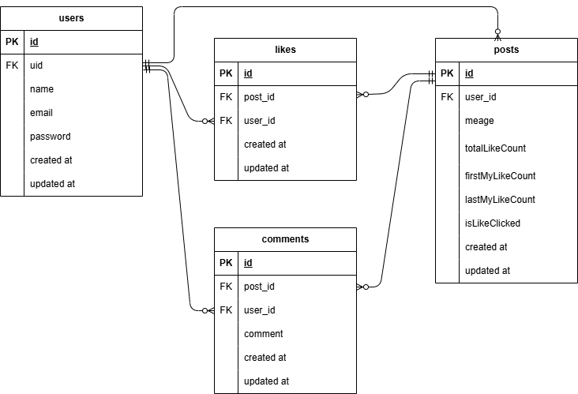

# README

# README.md

# Twitter風SNSアプリ

## プロジェクト名: sns-app

**GitHubリポジトリURL :  github.com:oxnut134/sns-app.git**

```jsx
**markdown**
### Clone with SSH
```bash
git clone git@github.com:oxnut134/sns-app.git
```

---

## １)基本構成

今回のプロジェクトはフロントエンドをNext.js、バックエンドをLaravelで構築しました。また、プロジェクトディレクトリはsns-appとして、その直下にfrontendディレクトリとbackendディレクトリを配置し、ローカルリポジトリはsns-appディレクトリに設定しました。

### １－１）ディレクトリ構成

```
sns-app/
├── backend/        # Laravel (API)
├── frontend/       # Next.js (UI)
├── README.md       # README
├── sns-app.drawio  # ER図（編集用）
└── sns-app.png     # ER図（イメージデータ）
```

### プロジェクトclone作成

git clone git@github.com:oxnut134/sns-app.git

## ２）フロントエンドの立ち上げ

### ２－１）Next.js

　**ライブラリのインストール**

```jsx
　　　**bash**
　　　npm install 
　　　　　※node_modulesフォルダが作成される。
```

　**環境設定ファイルの作成** 

```jsx
　　**.**env.local**：**FirebaseのAPIキーなどを記述。
　　  **text**
　　　NEXT_PUBLIC_FIREBASE_API_KEY=your_api_key
　　　　　　.
　　　　　　.
　　　　　　.
```

　**Next.js起動**

```jsx
　　　**bash**
　　　npm run dev 
```

**Firebase設定**
本プロジェクトは Firebase Authentication を使用しています。

1. Firebase Console でプロジェクトを作成。
2. Authentication メニューから「メール/パスワード」認証を有効にする。
3. アプリ設定から Web アプリ用の設定値を取得し、frontend/.env.local に記述。

## ３）バックエンドの立ち上げ

### ３－１）laravel

本プロジェクトでは Docker を使用して PHP(Nginx) および MySQL 環境を構築しています。

**Docker立上げとパッケージインストール**

```jsx
docker-compose up -d —build
docker-compose exec php bash
composer install
```

　**APP_KEY作成**
　　`php artisan key:generate` 

### ３－２）データベース

　**MySQLコンテナログイン**

```bash
　　docker-compose exec mysql bash
```

　**MySQL起動**

```css
　　mysql -u laravel_user -p
```

　　※パスワード入力

　**Database確認**

```
　　show databases;
```

　**.env設定**　

```
DB_CONNECTION=mysql
DB_HOST=mysql
DB_PORT=3306
DB_DATABASE=laravel_db
DB_USERNAME=laravel_user
DB_PASSWORD=laravel_pass
```

### ３－３）マイグレーション

```jsx
  php artisan migrate
```

### ３－４）シーディング

今回はFirebaseでユーザー認証を行っていますので、Firebaseの設定を行ったのちに、ユーザー登録をお願いします。

## ４）利用技術

### フロントエンド

- **Next.js** 16.0.3（Turbopack）
- **React** 19.2.3
- **Firebase** @12.6.0
- **React-Hook-Form** @7.69.0

### バックエンド

- **Laravel Framework** 8.83.29
- **PHP** 8.2/8.3
- **Nginx** 1.21.1
- **MySQL** 8.0.26
- **Docker** 27.5.1

## ５）ＥＲ図



## ６）ＵＲＬ

### ６－１）フロントエンド

- **開発環境**        [http://localhost:3000](http://localhost:3000)
- **Next.js公式ドキュメント**　[nextjs.org](http://nextjs.org/)
- **React公式ドキュメント**　[react.dev](http://react.dev)
- **JavaScript公式ドキュメント**[developer.mozilla.org](http://developer.mozilla.org)
- **Firebase サイト**　[firebase.google.com](http://firebase.google.com)
- **React-Hook-Form公式ドキュメント**　[react-hook-form.com](http://react-hook-form.com)

### ６－２）バックエンド

- **開発環境**　 [http://localhost/](http://localhost/)
- **Laravel公式ドキュメント**  [laravel.com](http://laravel.com)
- **Docker公式ドキュメント**　[docs.docker.com](http://docs.docker.com/)

