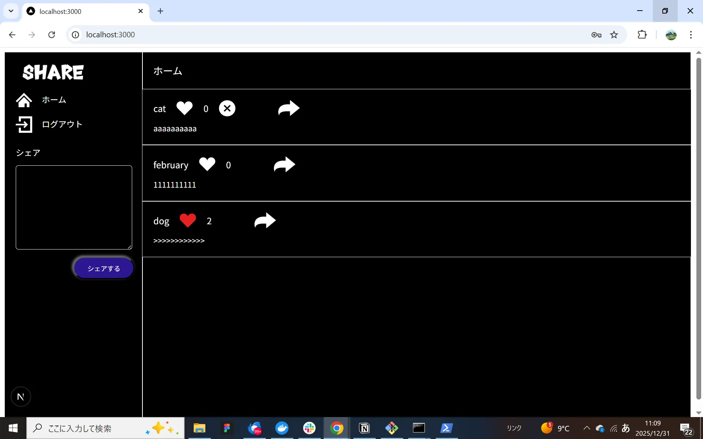

# README

# README.md

# Twitter風SNSアプリ

## プロジェクト名: sns-app

## １)概要説明

今回は実践モダン開発課題の中でTwitter風SNSアプリを選択して作成しました。
メッセージの投稿(シェア）、いいね、削除の各機能を有し、ページ遷移の後メッセージへのコメントもできるようになっています。



## ２)作成した目的

COACHTECH６か月コース終了後、フロントエンド学習を行ってきましたが、それらへの理解を確認するとともに、さらにレベルアップを図るため、実践モダン開発課題の中から本テーマを選択して取り組みました。Twitter（現X）は、以前から利用していましたので、その仕組みにも関心があったことが選択理由です。

## ３)アプリケーションＵＲＬ

**GitHubリポジトリURL :  github.com:oxnut134/sns-app.git**

```jsx
**markdown**
### Clone with SSH
```bash
git clone git@github.com:oxnut134/sns-app.git

```

## 4)機能一覧

```jsx
ユーザー登録
ログイン・ログアウト
投稿一覧取得
投稿追加・削除
いいね追加・削除
コメント追加
```

## ５）使用技術

### フロントエンド

- **Next.js** 16.0.3（Turbopack）
- **React** 19.2.3
- **Firebase** @12.6.0
- **React-Hook-Form** @7.69.0

### バックエンド

- **Laravel Framework** 8.83.29
- **PHP** 8.2/8.3
- **Nginx** 1.21.1
- **MySQL** 8.0.26
- **Docker** 27.5.1

## ６)テーブル設計

[sna-appテーブル仕様.pdf](sna-app%E3%83%86%E3%83%BC%E3%83%96%E3%83%AB%E4%BB%95%E6%A7%98.pdf)

## ７)ＥＲ図


## ８）環境構築

## ８－１)基本構成

今回のプロジェクトはフロントエンドをNext.js、バックエンドをLaravelで構築しました。また、プロジェクトディレクトリはsns-appとして、その直下にfrontendディレクトリとbackendディレクトリを配置し、ローカルリポジトリはsns-appディレクトリに設定しました。

### ディレクトリ構成

```
sns-app/
├── backend/        # Laravel (API)
├── frontend/       # Next.js (UI)
├── README.md       # README
├── sns-app.drawio  # ER図（編集用）
└── sns-app.png     # ER図（イメージデータ）
```

### プロジェクトclone作成

git clone git@github.com:oxnut134/sns-app.git

## ８－２）フロントエンドの立ち上げ

### Next.js

　**ライブラリのインストール**

```jsx
　　　**bash**
　　　npm install 
　　　　　※node_modulesフォルダが作成される。
```

　**環境設定ファイルの作成** 

```jsx
　　**.**env.local**：**FirebaseのAPIキーなどを記述。
　　  **text**
　　　NEXT_PUBLIC_FIREBASE_API_KEY=your_api_key
　　　　　　.
　　　　　　.
　　　　　　.
```

　**Next.js起動**

```jsx
　　　**bash**
　　　npm run dev 
```

**Firebase設定**
本プロジェクトは Firebase Authentication を使用しています。

1. Firebase Console でプロジェクトを作成。
2. Authentication メニューから「メール/パスワード」認証を有効にする。
3. アプリ設定から Web アプリ用の設定値を取得し、frontend/.env.local に記述。

## ８－３）バックエンドの立ち上げ

### [ laravel ]

本プロジェクトでは Docker を使用して PHP(Nginx) および MySQL 環境を構築しています。

**Docker立上げとパッケージインストール**

```jsx
docker-compose up -d —build
docker-compose exec php bash
composer install
```

　**APP_KEY作成**
　　`php artisan key:generate` 

### [ database ]

　**MySQLコンテナログイン**

```bash
　　docker-compose exec mysql bash
```

　**MySQL起動**

```css
　　mysql -u laravel_user -p
```

　　※パスワード入力

　**Database確認**

```
　　show databases;
```

　**.env設定**　

```
DB_CONNECTION=mysql
DB_HOST=mysql
DB_PORT=3306
DB_DATABASE=laravel_db
DB_USERNAME=laravel_user
DB_PASSWORD=laravel_pass
```

### ・migration

```jsx
  php artisan migrate
```

### ・seeding

今回はFirebaseでユーザー認証を行っていますので、Firebaseの設定を行ったのちに、ユーザー登録をお願いします。